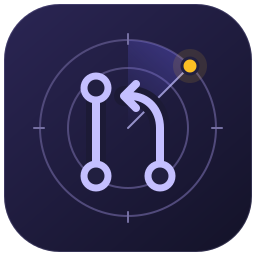

<p align="center">
  
</p>

# Review Radar

An actionable, cross-platform GitHub pull-request workspace.

Review Radar answers three questions quickly:

1. What needs my attention now?
2. Has someone reviewed or commented on one of my pull requests?
3. What is the current health of pull requests I own or follow?

It is intentionally an action queue, not a generic notification feed.

## Architecture

Review Radar uses a shared Rust core with native platform shells:

- Linux: Qt 6/QML application, with optional Quickshell integration.
- macOS: SwiftUI application and menu-bar integration.
- Windows: WinUI 3 application and system-tray integration.

The shared core owns GitHub data, ranking, event transitions, acknowledgement,
and snoozing. Platform shells own only presentation and OS integration.

See [the project plan](docs/project-plan.md) and
[the architecture](docs/architecture.md). The
[prototype findings](docs/prototype-findings.md) record which behavior is being
carried forward from the existing Quickshell implementation.

See the [low-fidelity mockups](docs/mockups/README.md) for the five workspace views
and the shared PR detail layout.

## Repository layout

```text
apps/
  linux-qt/       Linux Qt/QML shell and Quickshell adapter
  macos/          Future SwiftUI shell
  windows/        Future WinUI 3 shell
crates/
  domain/         PR model, prioritisation, and event transitions
  github/         GitHub API client and snapshot normalisation
  state/          Local acknowledgement and snooze persistence
  platform/       Platform-neutral notification/launch contracts
docs/             Product plan, architecture, and decisions
tests/fixtures/   GitHub snapshot fixtures shared by all clients
```

## Status

The GitHub collector, ranked domain projection, local acknowledgement/snooze
state, platform-effect contracts, and freedesktop native notifications are
implemented. An initial standalone Linux Qt/QML client is available; Quickshell
integration is pending.

## GitHub data spike

The first Rust component collects bounded GitHub snapshots into SQLite. Docker is
the supported development and execution environment; an authenticated
[GitHub CLI](https://cli.github.com/) supplies the token.

```sh
mkdir -p data
GH_TOKEN="$(gh auth token)" docker compose run --rm collector
docker build --target builder -t review-radar-builder .
docker run --rm review-radar-builder cargo test --workspace --locked
```

The collector writes private local data to `data/review-radar.sqlite3`, which is
gitignored. See [the data-spike notes](docs/github-data-spike.md) for the schema,
query bounds, and unresolved data gaps.

A generalized version of the real capture is committed at
`tests/fixtures/github/github-snapshot.json` for deterministic offline tests.

Render a ranked JSON workspace from the latest local capture:

```sh
docker compose run --rm queue --view tailored
```

## Desktop app in Docker

Run the Qt/QML app in Docker while it renders through your host desktop session:

```sh
./scripts/desktop
```

The `desktop` service uses the host Wayland socket when available (including
Hyprland) and otherwise uses the mounted X11 socket (including i3). It keeps
captures and local state in the gitignored `data/` directory. Run the command
from the graphical session so `XDG_RUNTIME_DIR`, `WAYLAND_DISPLAY`, and/or
`DISPLAY` are available. The script obtains the authenticated GitHub token and
passes your host UID/GID to the container; an already-exported `GH_TOKEN` wins.
It also supplies an empty temporary Xauthority file for Wayland-only sessions
that do not have `~/.Xauthority`.
