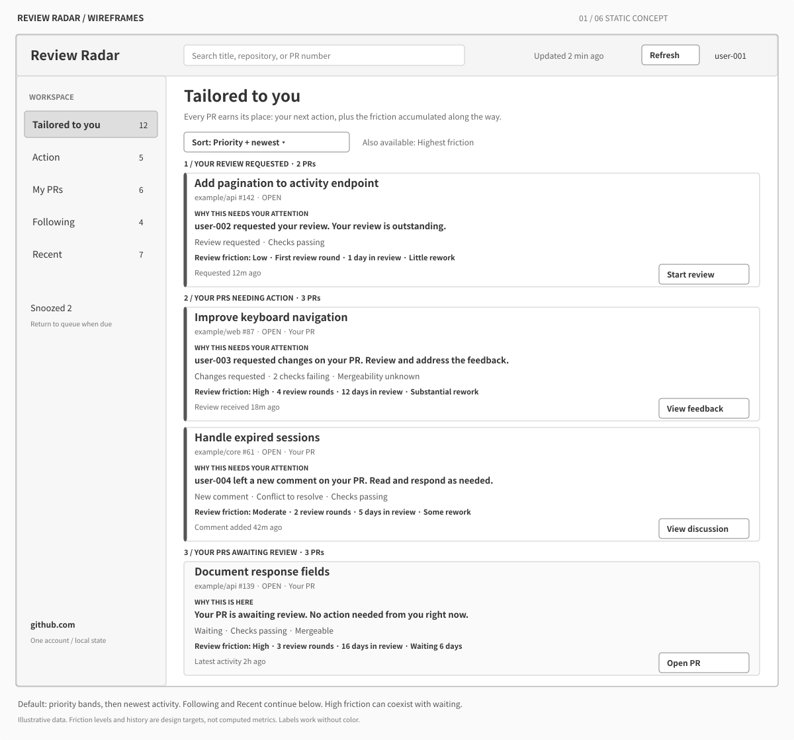
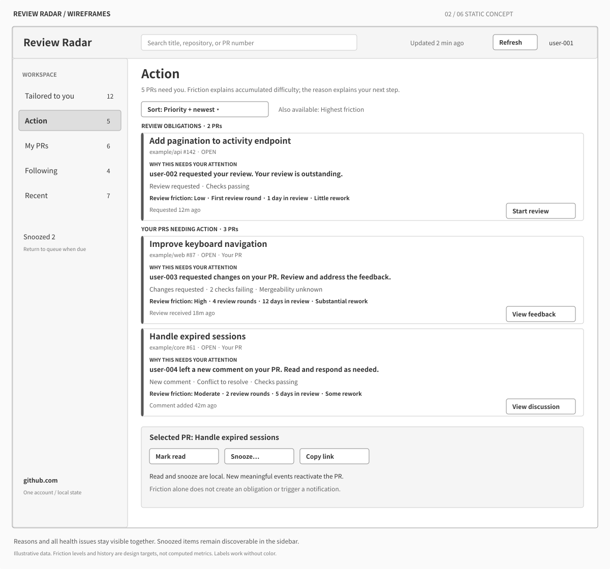
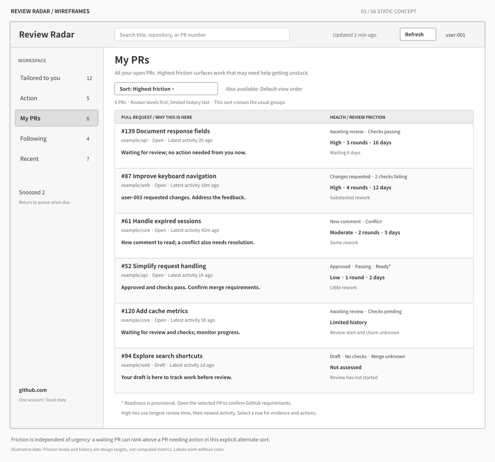
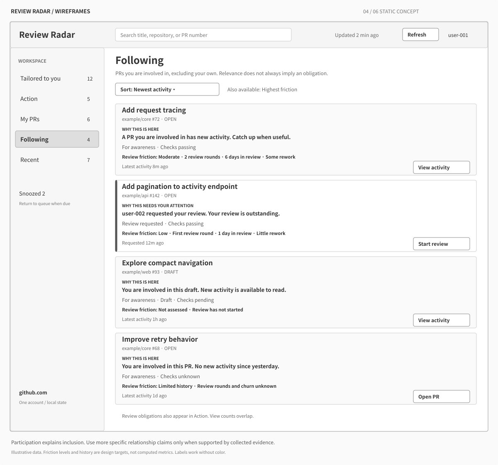
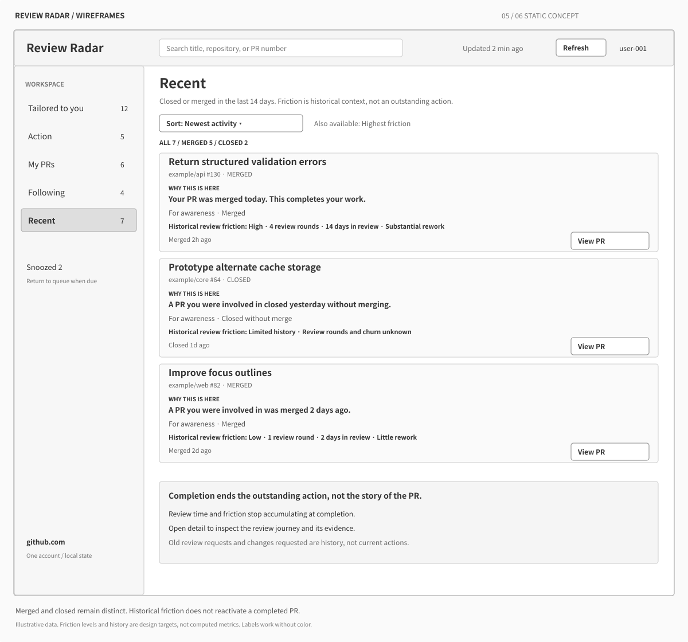
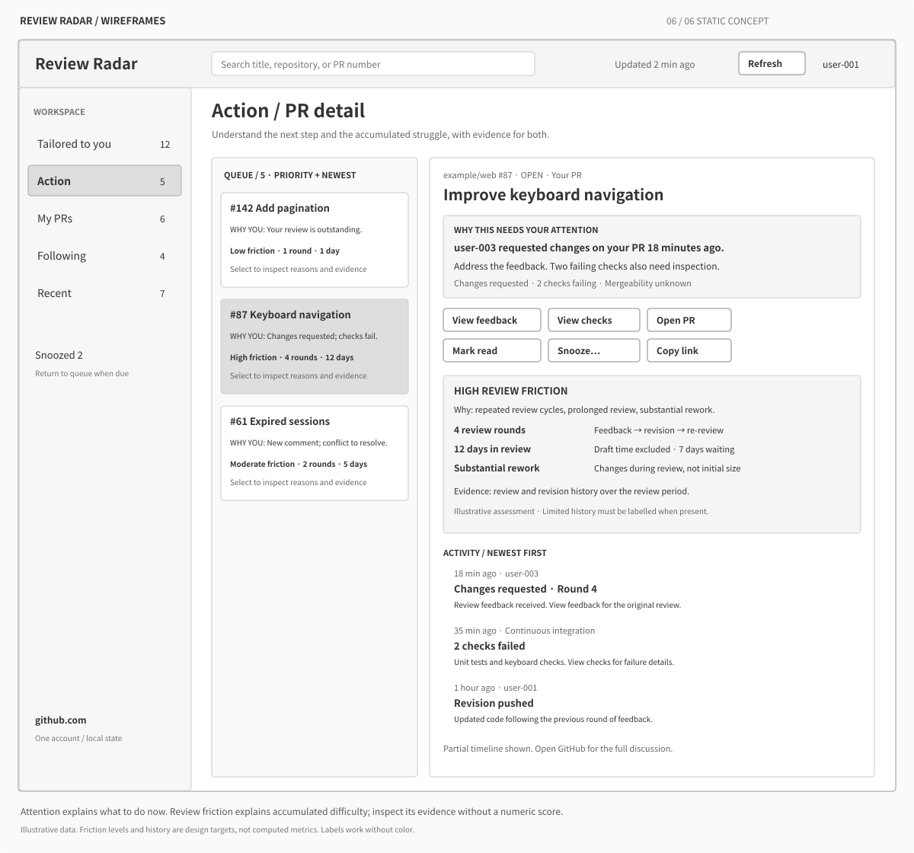

# Low-fidelity mockups

Static design proposals, using illustrative data. Each screen is available as a
PNG and an editable SVG of the same name. Counts describe the full view; list
screens show only a visible subset. These are proposed UI behaviors, not a record
of implemented functionality.

Every card now leads with **Why this needs your attention**, or **Why this is
here** for waiting and informational items. **Review friction** makes the PR's
accumulated difficulty visible with explanatory contributors. Levels, durations,
review rounds, and churn are illustrative design data, not calculated metrics.
The [implementation concept](../attention-and-review-friction.md) records signal
definitions, missing-history behavior, ranking semantics, and implementation work.

## 1. Tailored to you — what should I do next?

Explicit priority-group headings explain the ranking. Prominent personal reasons
and next actions explain each card's place. Health and review friction remain
separate, so multiple problems and accumulated struggle stay visible together.
The remaining following and recent groups continue below the visible area.

## 2. Action — what needs my attention?

Use the same cards, filtered to outstanding attention. Keep review obligations
distinct from action on authored PRs. Local read/snooze actions are available from
the selected PR, and snoozed items remain discoverable in the sidebar.

## 3. My PRs — how healthy is my work?

A denser table pairs each PR's justification with health and review friction.
This frame demonstrates **Highest friction** sorting across the usual groups:
high-friction waiting work can precede items needing action. Unknown history and
not-yet-assessed drafts are explicit. Health remains visible after acknowledgement.

## 4. Following — what is happening around my work?

Explain participation separately from urgency. This view can overlap Action when
a followed PR requests a review; view counts are not additive. Detailed reasons
such as “you commented” would require richer participation data than the current
collector's search memberships, so these frames use “you are involved.” Friction
is visible for both actionable and awareness-only items.

## 5. Recent — what finished?

Show the last 14 days of completions with an explicit merged/closed distinction.
Lifecycle takes precedence over old attention labels. Keep discussion history
available from the same detail view. Historical friction stops accumulating at
completion and never turns a completed PR into an outstanding action.

## 6. PR detail — what changed, and what can I do?

A split view retains reasons and friction in the compact queue. The selected PR
shows a prominent attention summary, all health issues, contextual actions, and
an explainable friction breakdown above a newest-first timeline. Timeline display
truncation is distinct from assessment coverage. CI transitions and review-cycle
evidence shown here are design targets. For review obligations, “Start review”
links to the PR's Files changed page.

## Shared representation

- Sidebar: stable view names and scoped counts.
- Header: search, last successful refresh, manual refresh, active account.
- PR identity: repository/number, lifecycle, title.
- Attention: a prominent, evidence-backed personal reason and matching next step.
- Relevance: waiting/awareness explanations for items without an outstanding action.
- Review friction: Low/Moderate/High plus contributors, Limited history, or Not assessed.
- Age: latest activity time, independent of the reason for attention.
- Detail: consistent browser, mark-read, snooze, and copy-link actions.
- Ordering: the documented priority bands for Tailored and Action; newest activity
  first within each band. Following and Recent use newest activity first. My PRs
  uses authored-action, awaiting-review, and draft groupings as a design proposal.
  The optional Highest friction sort crosses these groups within the current view;
  the My PRs frame shows it selected. It does not change attention or membership.

The frames target the standalone desktop workspace. A Quickshell bar entry would
launch this workspace and expose its attention count.

## Regeneration

Run `python3 docs/mockups/render.py` from the repository root (Python 3 and
`rsvg-convert` required). The shared layout and illustrative data in `render.py`
generate all six editable SVGs and their matching PNGs. Edit the generator when
revising the frames so regeneration preserves the changes.
