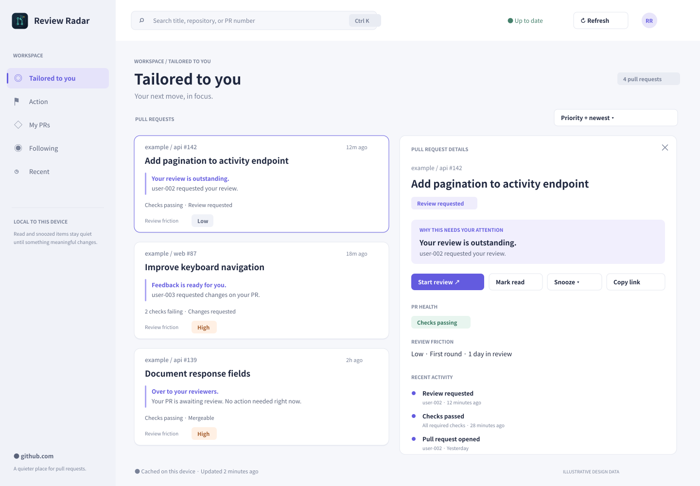

# High-fidelity workspace references

## Preferences exploration

Open [preferences.html](preferences.html) in a browser for the interactive,
responsive preferences design. It includes nine sections, independent notification,
tray and Quickshell switches, draft/save/cancel behavior, notification availability
states, and illustrative previews. Serve the repository with a local HTTP server
to inspect it using browser tooling. No dependencies or build step are required.

Settings are exploratory candidates, not implemented application capabilities.
Changes live only in page memory; no desktop effects, GitHub requests, credentials,
or application databases are used. Reloading resets the prototype.

Six editable SVGs and matching 1440 × 1000 PNGs, created before the Qt rewrite.
Run `python3 docs/mockups/high/render.py` to regenerate (requires `rsvg-convert`).

| Workspace | Reference |
| --- | --- |
| Tailored to you | [01-tailored.png](01-tailored.png) |
| Action | [02-action.png](02-action.png) |
| My PRs | [03-my-prs.png](03-my-prs.png) |
| Following | [04-following.png](04-following.png) |
| Recent | [05-recent.png](05-recent.png) |
| Selected PR / activity | [06-detail.png](06-detail.png) |

## Visual system

- Canvas `#f6f7fb`, sidebar `#f0f2f8`, white surfaces, borders `#e4e7ef`.
- Ink `#20283f`, secondary `#596279`, muted `#788197`, accent `#635bdf`.
- Indigo indicates selection/action; amber indicates friction; labels always
  accompany color. Lifecycle is separate from attention and review friction.
- 8px spacing rhythm, 12px card corners, 34–38px controls, 30px workspace titles.
- The ranked queue stays visible alongside an independently scrolling detail
  panel. Narrow windows show the selected detail in place of the queue.
- Search and sorting remain available in every workspace. Search is local.

## Implementation mapping

The first Qt pass uses shared cards in all five workspaces rather than a separate
authored-PR table. It preserves the Rust-provided ordering, explanations, health,
friction, and events. The detail panel exposes browser, read, snooze, copy, and
activity actions. The application displays actual current-view counts and cache
status; it does not manufacture global counts or account identities.

Reference data (including review friction and timeline examples) is illustrative.
Live data may have limited history; the implementation retains those limitations.
Priority group headings and a dense authored-PR table remain later refinements.

## Verified Qt renders

These screenshots come from the real QML workspace using the isolated Qt test
fixture, rather than the SVG generator:

- [Implemented workspace](implemented-workspace.png)
- [Implemented detail panel](implemented-detail.png)
- [Implemented narrow window (860 × 640)](implemented-narrow.png)
- [Implemented Preferences](implemented-preferences.png)
- [Implemented Preferences at 860 × 640](implemented-preferences-narrow.png)
- [Implemented Desktop integration preferences](implemented-desktop-integration.png)

Set `UI_SCREENSHOT_DIR` to an existing writable directory when running
`review-radar-ui-test` to capture these three frames again. Screenshots use
illustrative data and contain no private capture content.
